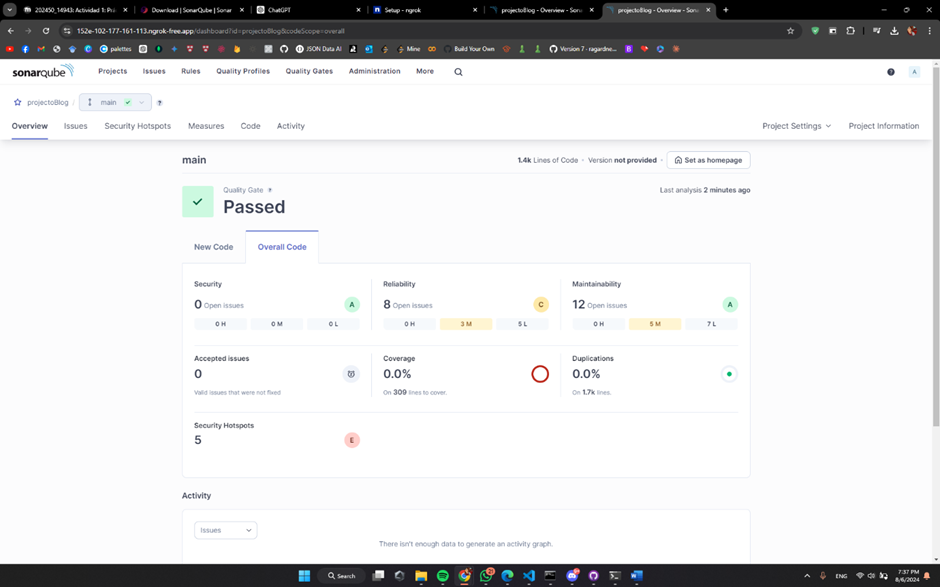
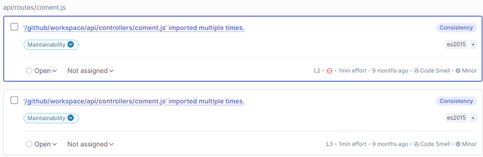
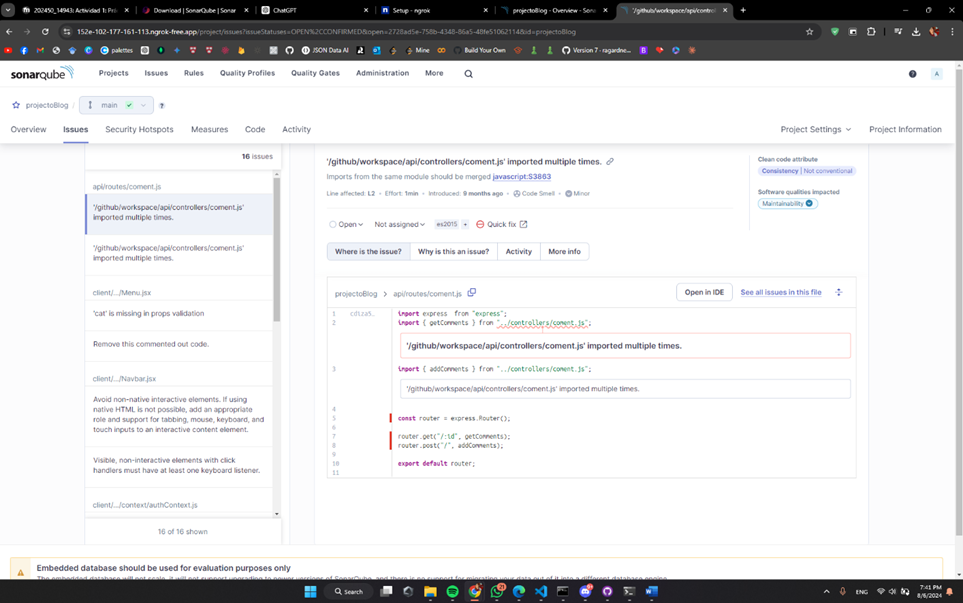
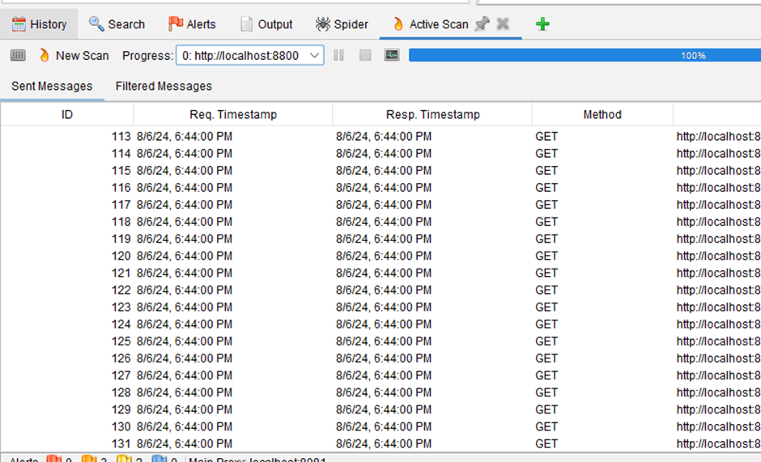
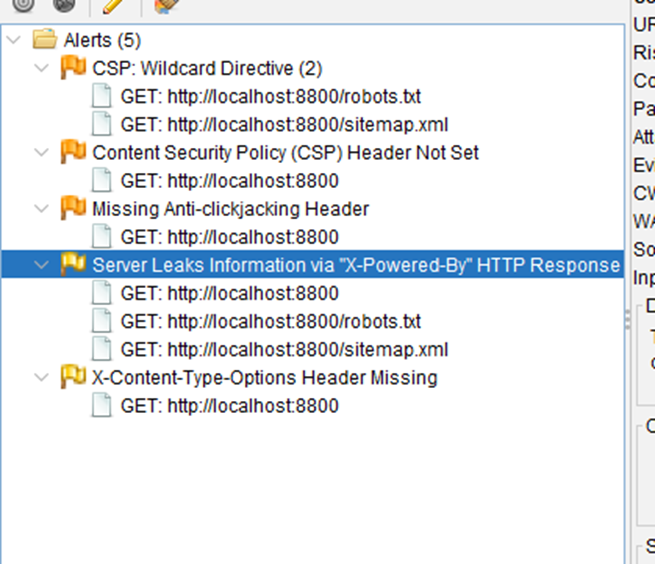

# Blog Educativo

Aplicación React con una API backend. Sigue las instrucciones a continuación para configurar y ejecutar el proyecto.

## Requisitos previos

- Node.js (versión 14 o superior)
- npm (normalmente viene con Node.js)
- SonarQube (última version)
- Ngrok (última version)

## Configuración

### Cliente (Frontend)

1. Navega a la carpeta del cliente:

   ```sh
   cd client
   ```

2. Instala las dependencias:
   ```sh
   npm install
   ```

### API (Backend)

1. Navega a la carpeta de la API:

   ```sh
   cd api
   ```

2. Instala las dependencias:

   ```sh
   npm install
   ```

3. Crea un archivo `.env` en la carpeta `api` con el siguiente contenido:
   ```sh
   JWT_SECRET = "]K@l9w6SnF3"
   ```

### Base de datos

Asegúrate de utilizar la base de datos blog.sql proporcionada en la carpeta `base de datos`.

### Certificados

Crear una carpeta certi en la cual se deben generar los archivos .pem para el certificado y la llave pública.

## Ejecución de la aplicación

1. Inicia el servidor API (desde la carpeta `api`):

   ```sh
   npm start
   ```

2. En otra terminal, inicia el cliente React (desde la carpeta `client`):
   ```sh
   npm start
   ```

La aplicación debería estar ahora funcionando. El cliente React generalmente se ejecuta en [https://localhost:3000](https://localhost:3000), y la API en otro puerto (comúnmente [https://localhost:8800](https://localhost:8800), pero verifica la configuración de tu proyecto).

## Configuración de SonarQube

1. Descargar SonarQube desde la página oficial de SonarQube.
2. Descomprimir el archivo descargado.
3. En la carpeta bin ejecutar el archivo StartSonar.bat.

## Configuración de Ngrok

1. Descargar Ngrok desde la página oficial de Ngrok.
2. Ejecutar el Ngrok.exe
3. En la consola ingresar el siguiente comando:

   ```sh
   ngrok http 9000
   ```

4. Copiar la URL generada por Ngrok y replazarla en las configuraciones de Github en la variable SONAR_HOST_URL.

## Ejecución de pruebas

Para ejecutar las pruebas, sigue las instrucciones a continuación:

1. Navega a la carpeta de la API:

   ```sh
   cd api
   ```

2. Ejecuta el siguiente comando:

   ```sh
   npm test
   ```

## Resultados de Análisis Estático

Después de ejecutar las pruebas, se obtuvieron los siguientes resultados:


Podemos encontrar que tuvimos 8 problemas de fiabilidad y 10 de mantenibilidad. Sin embargo, de todos estos solo 1 de ellos corresponde a errores con nuestro proyecto back-end.


Un problema de consistencia que se refleja ya que se importaba, innecesariamente, un controlador en más de una ocasión.



## Resultados de Análisis Dinámico

Después de ejecutar las pruebas, se obtuvieron los siguientes resultados:


A partir del análisis automático se encontraron 5 vulnerabilidades las cuales se pueden ver en la imagen a continuación.



## Resolución de problemas

Para resolver los problemas encontrados en el análisis estático y dinámico se realizaron implementaciones dentro del código para mitigar los resultados obtenidos en los análisis.
